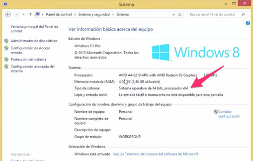
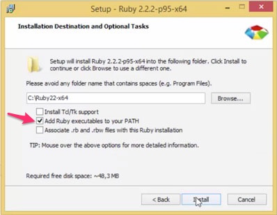

# Ruby installation
# Installation in Windows 📜
## Process 💻

To install Ruby on Windows you must download and install two independent packages: Ruby and DevKit.

## Ruby installation

The steps you must take to install Ruby are the following:

1. Go to [this page] (https://rubyinstaller.org/downloads/) and download the ** Ruby 2.3.3 (x64) ** version (if your processor and operating system are 64-bit) or ** Ruby 2.3.3 ** (if your processor or operating system is 32 bits).


  
⚠**NOTE:**:_To verify if your computer is 32 or 64 bits, enter ** Control Panel **> ** System and Security **> ** System ** and look for a line that says ** Type of System**._
   

   
   

2. Run the installer you downloaded in the previous step.

3. Follow the installation instructions. However, be careful when you see the following screen and select the ** Add Ruby Executables to your PATH ** option as shown in the following image:

   

   ⚠**NOTE:**:_Memorize or copy the route where Ruby is going to be installed because you will need it later._

That's it. Now we have to install the Ruby Development Kit.

## DevKit installation

1. Enter the same page from which you downloaded Ruby and look for a title called ** DEVELOPMENT KIT ** in the left column.

2. Download the 32 or 64 bit version depending on your device.

3. Run the installer.

4. When asked where to extract the package, change the path to `C: \ DevKit` as shown in the following image:

   ![Path] (extract-devkit.jpg)

5. Once the DevKit installation is complete, open the ** Command Prompt ** and execute the following commands (not including the `>` symbol):

   ```
   cd C: \ DevKit
   ruby dk.rb init
   ```

6. Open the file `C: \ DevKit \ config.yml` with ** Notepad ** or another text editor and verify that it includes a line with the path where you installed Ruby. If not, add it manually. For example, if the installation was in `C: \ Ruby23-x64`, the following line must exist in` config.yml`:

   ```
   - C: \ Ruby23-x64
   ```

7. Execute the following command in the ** Command Prompt **:

 ```
  ruby dk.rb install
 ```

## Verify your installation

Execute the following command in the **Command Prompt**:

```
ruby -v
```

I should show you the version you just installed.

⚠**NOTE:** _If not, if it tells you that the command is not recognized, restart your machine and try again._

---
## By 📌
[NicoPatalagua](https://www.instagram.com/nicopatalagua/) 😎
